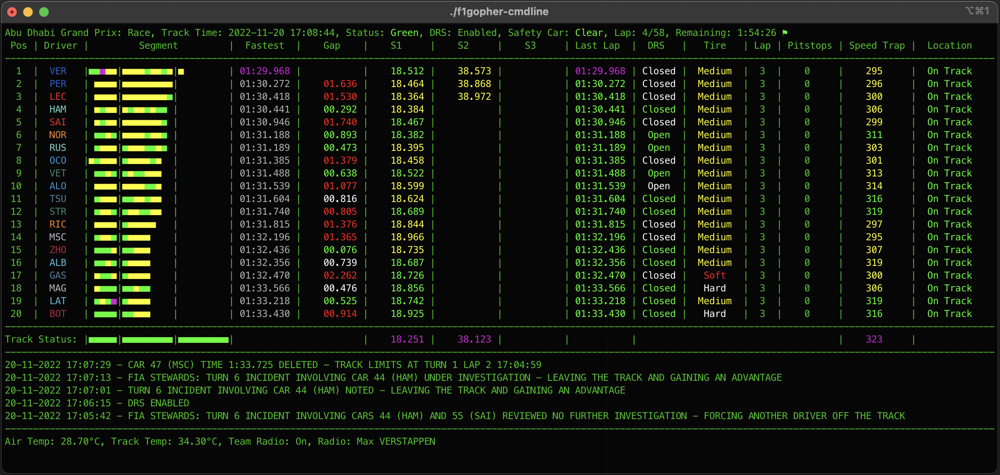
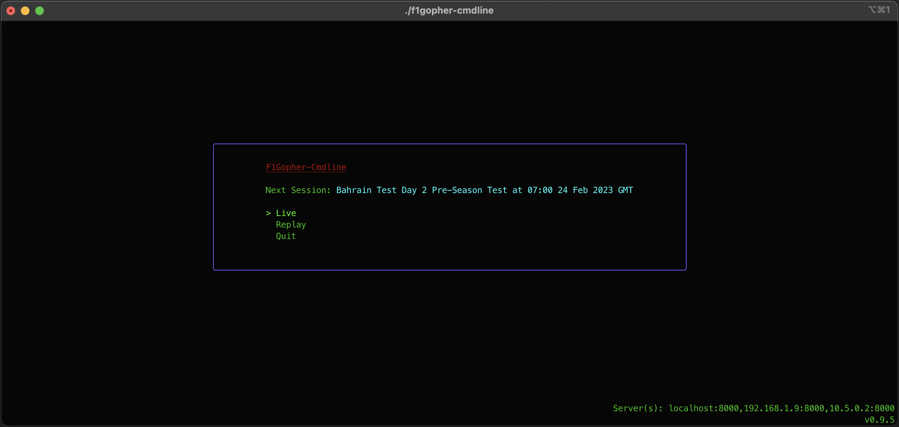
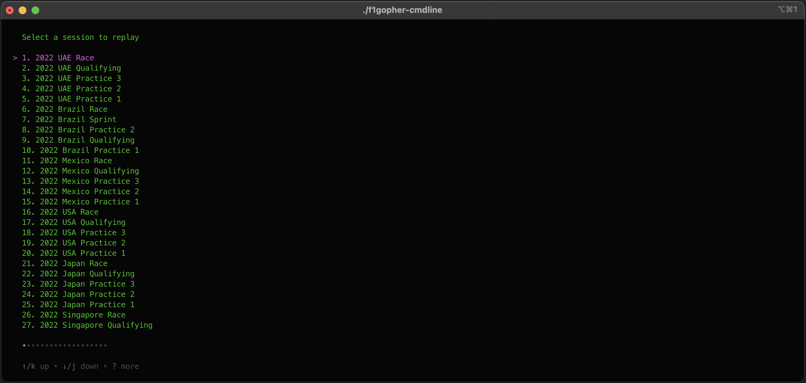

### F1Gopher - Command Line

F1Gopher is a command line frontend to the [F1Gopher library](https://github.com/f1gopher/f1gopherlib).

It allows you to view timing data and more from Formula 1 events, either live or replays of previous events.

## Features

* Replay all sessions (practices, qualifying, sprint and races) from all events from 2018 to now
* Watch data from sessions lives as they happen
* Watch data from pre-season test sessions live
* Listen to driver radio messages
* Pause and resume live sessions
* Skip forward through replay sessions
* Web server that duplicates the display onto a web page

### Timing

* Driver position
* Segment times for each driver that show if they were faster than their previous best, faster than anyone or slower
* Drivers fastest lap for the session
* Gap to the driver in front or gap to the fastest lap (for qualifying)
* All three sector times and last lap time color to show if the time is a personal best, fastest overall or slower
* DRS open or closed and whether the car is currently within one second of the car in front and potentially able to use DRS
* Current tire being used and number of laps the tire has been used for
* Last speed when going through the speed trap
* Location of the car (on track, outlap, pitlane, stopped...)
* Segment state for the track (is the segment green, yellow or red flagged)
* Fastest sector and laptimes for anyone in that session

### Weather

* Whether it is raining or not
* Air and track temperature

### Radio

* Plays the drivers radio messages as they happen
* Or mute them

### Race Control Messages

* Displays all messages from race control

### Keyboard Shortcuts

* Escape - back to main menu
* Up Cursor - Skip forward 1 minute
* Ctrl+] - Skip forward 5 seconds
* Right Cursor - Skip forward 1 lap
* r - Toggle radio being muted
* t - Toggle gap between gap to driver infront and gap to leader
* p - Toggle pause
* s - Skip to the start of the session

### Screenshots

#### Main Menu

#### Replay Menu
